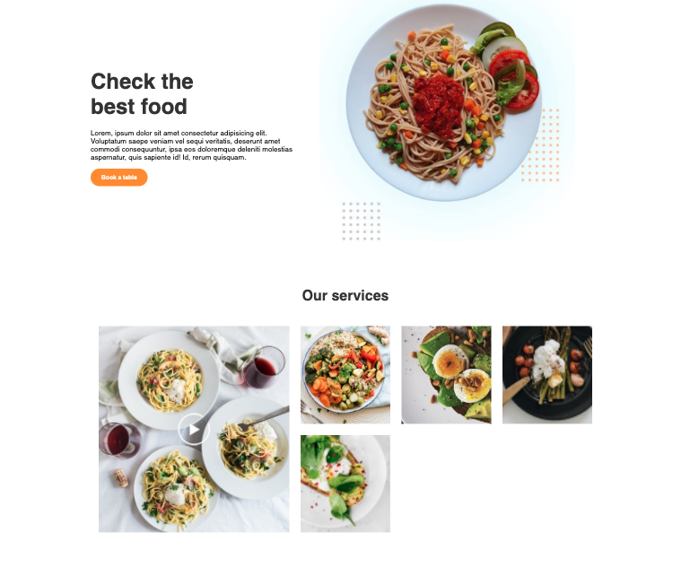
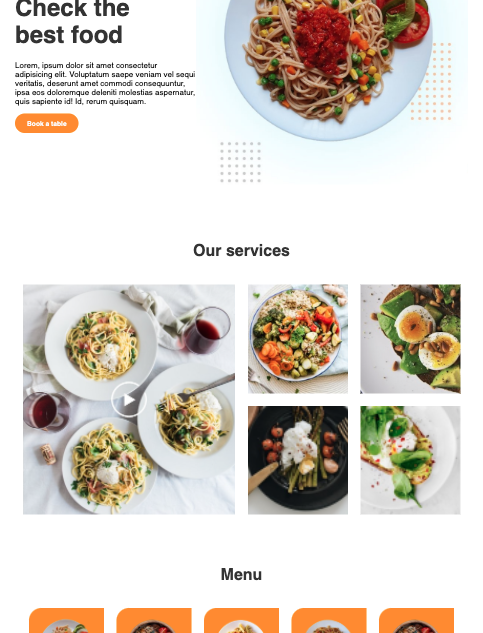

# Curso de Grid

Este proyecto es el aprendizaje del Grid Css del curso de Platzi. 
Incluye los siguientes temas:

- Propiedades del contenedor.
- Alineación.
- Ubicación.
- Minmax y repeat
- Keywords (fr, auto-fill, auto-fit).
- Proyecto responsivo.

## Proyecto terminado

### Desktop

### Mobile

